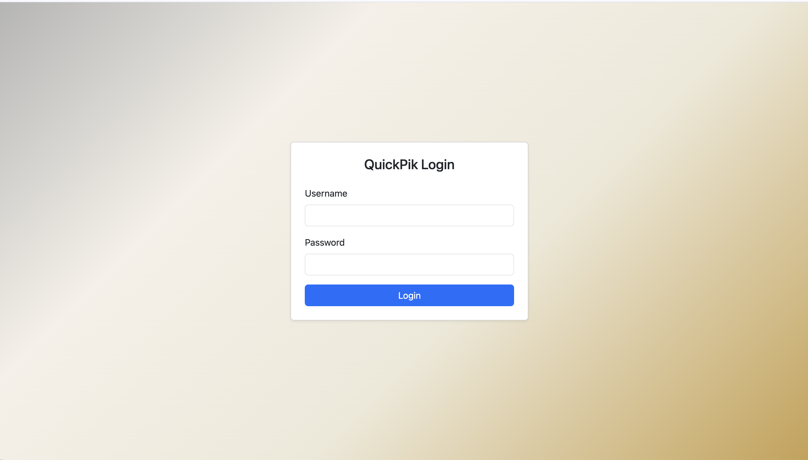
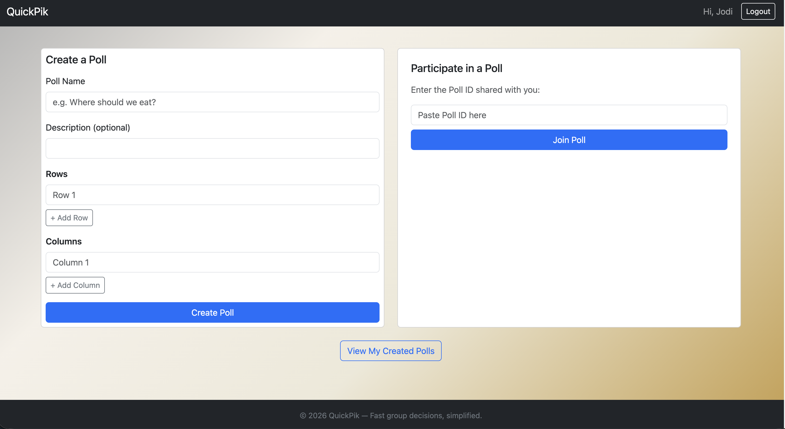
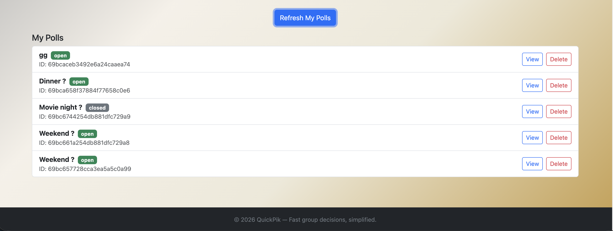
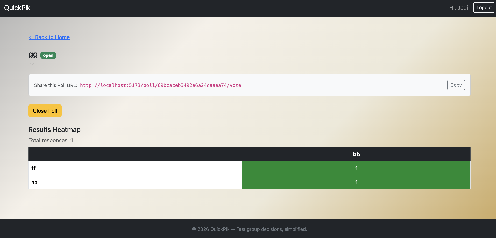
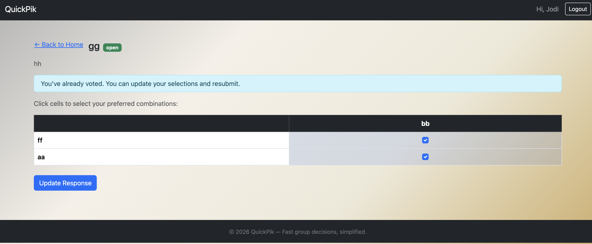

# QuickPik
> A lightweight matrix-based decision platform that helps groups reach consensus fast.

---

## Description

In real-world group decisions — picking a restaurant, scheduling a meeting, prioritising tasks — discussions stall because everyone has slightly different preferences and there is no clear way to see where the group agrees.

**QuickPik** solves this by letting a creator build a decision matrix poll: rows and columns represent the options, participants check off their preferred combinations, and the system aggregates all responses into a visual heatmap. The heatmap instantly reveals the cell(s) with the strongest collective agreement, turning a messy group chat into a clear, data-driven decision.

---

## Project Resources

| Resource | Link |
|---|---|
| GitHub Repository | https://github.com/alex710joseph/QuickPik |
| Deployed Application | https://quickpik.onrender.com |
| Youtube Walkthrough | https://www.youtube.com/watch?v=_WbQWqszsSw |
| Design Document | https://docs.google.com/document/d/17_5AJiuvg-Nx1SQw5znsmwMXTlnKDfV8D4nitPJuhyg/edit?usp=sharing |
| Slide Deck | https://docs.google.com/presentation/d/17xqsvmVP7bAJJ5PQ1Jmx8r3SgIDZGLjNGViHeShNe4w/edit?usp=sharing |


---

## Build Instructions

### Prerequisites
- Node.js v18+
- A running MongoDB instance (local or Atlas)

### 1. Clone the repository
```bash
git clone https://github.com/alex710joseph/QuickPik.git
cd QuickPik
```

### 2. Start the backend
```bash
npm install
npm start
```
The Express server starts on **http://localhost:3000**.

### 3. Start the frontend
```bash
cd frontend
npm install
npm run dev
```
The Vite dev server starts on **http://localhost:5173** and proxies API calls to the backend.

---

## Test Credentials

There are 1000 user records registered into the mongo atlas database. From these 1000 users, there are multiple users who have created polls having 1000 votes. Use these account logins to explore the application as a reviewer or tester. Kindly note that users - `lleversha7` and `bgoninga` have polls containg 1000 votes, so you can visualize the result visualization of the heatmap on a large number of users. The process on how the data for submitting 1000 votes on these polls is explained in the `Synthetic Data Generation` section of this README.

| Username | Password |
| ---|---|
| `jdockray0` | `cbkno86` |
| `tmalin1` | `owrfp73` |
| `rvairow2` | `lloly42` |
| `hizzard9` | `ngonh35` |
| `bgoninga` | `bhrqm91` |
| `acatlin1v` | `ecmoh87` |
| `lleversha7` | `yzpzq00` |

---

## User Personas:
1. The Indecisive Friend Group ("Emma"):
Emma and her friends are trying to decide where to eat dinner and when to go. Instead of debating endlessly in a group chat, Emma creates a QuickPik matrix poll with five restaurant cuisines (Thai, Italian, Vietnamese, Mexican, Japanese) as rows and possible reservation times (6 PM, 7 PM, 8 PM) as columns. Each friend marks the combinations they are comfortable with. The resulting heatmap visualization highlights the time and cuisine combination with the strongest group preference, helping Emma quickly finalize the reservation.

2. The Project Team Lead ("John"):
Daniel is leading a student project and the team needs to decide which tasks should be prioritized for the next sprint. He creates a QuickPik matrix poll listing project tasks as rows (UI Design, Database Setup, Authentication System, API Integration) and priority levels as columns (Low, Medium, High). Each team member marks how important they believe each task is. The aggregated results produce a *priority heatmap*, making it immediately clear which tasks the majority of the team believes should be tackled first.

3. The Event Organizer ("Carla"):
Sofia is planning a weekend outing for her friends and needs to determine the best activity and day. She creates a QuickPik matrix poll with activity options (Hiking, Movie Night, Bowling, Dinner) and available days (Friday, Saturday, Sunday). As friends submit their availability and preferences, the heatmap clearly reveals the activity-day combination that works best for most participants.

## User Stories:

1. Matrix Creation and Management (Alex Joseph)

1.1. Create Matrix Poll:
As a user, I want to create a new QuickPik matrix poll with a title, row options, and column options, so I can structure a group decision problem in a grid format.

1.2. Edit Matrix Poll:
As a poll creator, I want to edit the matrix title, row options, or column options, so I can update the decision structure if plans change.

1.3. Delete Matrix Poll:
As a poll creator, I want to delete a matrix poll that is no longer needed, so outdated decisions do not remain in the system.

1.4. Close Poll:
As a poll creator, I want to close the poll once enough responses have been collected and visualize the final result as a heatmap.

2. Participant Input (Rajiv Philip)

2.1. Access Matrix Poll:
As a participant, I want to open a matrix poll using a shared link or poll ID, so I can view the decision grid and available options.

2.2. Submit Preferences:
As a participant, I want to select cells within the matrix that represent acceptable or preferred combinations, so my preferences are recorded accurately. I should also be able to see the current state of the decision matrix poll.

2.3. Update Preferences:
As a participant, I want to edit my selections before the poll closes, so I can adjust my preferences if plans change.

2.4. Remove Participation:
As a participant, I want to delete my submission if I decide not to participate anymore, keeping the dataset accurate.

Tech Stack:
* Backend: Node.js + Express
* Database: MongoDB (Native NodeJS Driver)
* Frontend: React with Hooks
* Styling: CSS / Bootstrap

---
Thus, QuickPik provides a simple but powerful way for groups to visualize collective preferences and move from indecision to clear consensus using an intuitive matrix heatmap.

## Screenshots

### Login


### Home — Create & Join a Poll


### My Created Polls


### Poll Management & Results Heatmap


### Vote Page


---

## Tech Stack

| Layer | Technology |
|---|---|
| Backend | Node.js + Express 5 |
| Database | MongoDB (Native Node.js Driver) |
| Session Store | connect-mongo + express-session |
| Frontend | React 19 + Vite 8 |
| UI Library | React-Bootstrap + Bootstrap 5 |
| Linting / Formatting | ESLint + Prettier |

---

## GenAI Usage

This project was developed with assistance from **Claude (Anthropic)** via Claude Code and Claude Sonnet 4.6, used for:

- Scaffolding the Express route structure (`auth`, `polls`, `submissions`)
- Generating the `VotePage` and `Footer` React components
- Refining this README
- Brainstorming the collections required for the application
- Creating the synthetic data generator python script to create polls with 1000 users
- Generating the step wise instructions on the help page

All AI-generated code was reviewed, tested, and integrated by the team members.

---

## Synthetic Data Generation
A python script was created that iterates over all the 1000 users generated via mockaroo and with each user, a submission record is created for a specified poll id. The code used can be found under /synthetic_data_generation

---

## Accessiblility Tests
Ran axe scans for all pages of the application and fixed all issues that were found such as:
1. color contrast of footer text not complying with wcag standards 
2. aria-label missing for MatrixGrid component
3. form labels missing for input fields in SignupPage.jsx, LoginPage.jsx and PollForm.jsx
4. color contrast of copy link and copy button not complying with wcag standards

Generated lighthouse report and fixed the following issues:
1. main landmark not found - fixed by putting the main content within the `<main><\main>` tags

Axe scans results on all pages after fixing all of the above listed issues:


Lighthouse report after fixing all of the above listed issues:


## Team

- **Alex Joseph** — Matrix Creation & Management
- **Rajiv Philip** — Participant Input & Results Visualization

*Course project supervised by John Alexis Guerra Gomez.*
